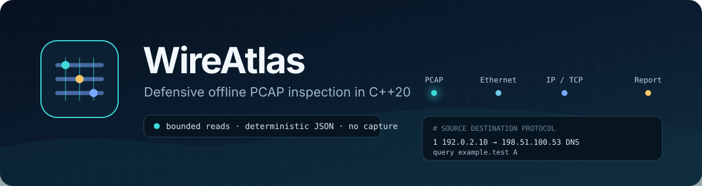
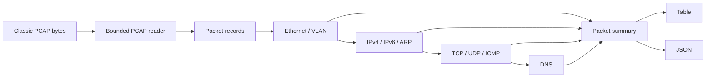

<p align="center">
  
</p>

<p align="center">
  <a href="https://github.com/ReedStel/WireAtlas/actions/workflows/ci.yml"></a>
  
  
  <a href="LICENSE"></a>
</p>

WireAtlas is a dependency-free C++20 command-line tool for inspecting classic PCAP files
without capturing or transmitting network traffic. It turns raw Ethernet frames into a readable
packet table or deterministic JSON while treating every byte as untrusted input.

I built it to explore the less glamorous parts of systems software: binary formats, byte order,
length fields, protocol layering, useful error messages, and the difference between a parser that
works on a demo and one that fails safely.

```text
#    TIMESTAMP         SOURCE                 DESTINATION            PROTOCOL    BYTES  DETAILS
1    1700000000.001000 192.0.2.10             198.51.100.53          DNS            72  query example.test A
2    1700000001.002000 192.0.2.10             198.51.100.53          TCP            54  49152 → 443 [SYN]
3    1700000002.003000 192.0.2.10             198.51.100.53          ICMP           44  type 8, code 0
```

All examples and tests are generated from documentation-only address ranges. The repository does
not contain real packet captures.

## What it handles

- Classic PCAP 2.4 in little- or big-endian form
- Microsecond and nanosecond timestamp variants
- Ethernet II and a single 802.1Q or 802.1ad VLAN tag
- IPv4, IPv6, TCP, UDP, ICMP, ICMPv6, ARP, and DNS questions
- DNS compression pointers with explicit loop detection
- Per-packet containment: a damaged frame is reported without hiding later valid frames
- Protocol, host, and result-limit filters
- Human-readable tables, summaries, and JSON output
- Safety limits for packet size, packet count, and total decoded bytes

WireAtlas deliberately does **not** sniff live interfaces, scan hosts, reassemble streams or IP
fragments, decrypt traffic, or modify captures. PCAPNG and IPv6 extension headers are future work.

## Build and try it

You need a C++20 compiler and CMake 3.20 or newer.

```bash
cmake -S . -B build -DCMAKE_BUILD_TYPE=Release
cmake --build build --config Release
ctest --test-dir build -C Release --output-on-failure
```

Generate the repository's safe demo capture and inspect it:

```bash
./build/wireatlas-sample synthetic-demo.pcap
./build/wireatlas inspect synthetic-demo.pcap
./build/wireatlas inspect synthetic-demo.pcap --protocol DNS --json
./build/wireatlas summary synthetic-demo.pcap
```

On a multi-configuration build such as Visual Studio, executables are normally under
`build/Release/`.

### Sixty-second review

If you are evaluating the repository, start with three things:

1. Run the synthetic capture generator and the `inspect` command above.
2. Open [`tests/tests.cpp`](tests/tests.cpp) to see malformed-input, endian, protocol, and output
   coverage without external fixture files.
3. Read [`docs/design.md`](docs/design.md) for the failure-containment and byte-boundary decisions.

That path shows the user experience, verification depth, and design reasoning without requiring a
real capture or privileged network access.

## CLI

```text
wireatlas inspect <capture.pcap> [--json] [--protocol NAME] [--host ADDRESS] [--limit COUNT]
wireatlas summary <capture.pcap> [--json] [--protocol NAME] [--host ADDRESS] [--limit COUNT]
```

`inspect` includes individual packets. `summary` returns aggregate counts only. Filters are applied
before counts are calculated, so every output describes exactly the selected view.

## Design



The decoder uses non-owning byte spans and checked reads. Structural PCAP errors stop the file;
protocol errors stay attached to the affected packet. That separation keeps offsets meaningful and
lets an analyst see valid packets surrounding a malformed one. More detail is in
[docs/design.md](docs/design.md).

## Quality gates

The test suite covers byte-order variants, truncated records, TCP/UDP/ICMP, IPv6, VLAN tags, DNS
queries, cyclic DNS compression pointers, filters, limits, and report output. CI builds with warnings
as errors on Linux, Windows, and macOS, then runs a separate ASan/UBSan job and a bounded libFuzzer
smoke test.

```bash
cmake --preset sanitizers
cmake --build --preset sanitizers
ctest --preset sanitizers
```

See [docs/pcap-safety.md](docs/pcap-safety.md) before inspecting captures from an untrusted source.

## Repository map

```text
include/wireatlas/  Public parser, model, decoder, and report interfaces
src/                Implementations and CLI entry point
tests/              Dependency-free regression suite
tools/              Synthetic capture generator
fuzz/               libFuzzer harness for file and packet parsers
docs/               Design and safety notes
```

## License

WireAtlas is public and source-available, but it is not open-source software under an OSI-approved
license. The included license permits viewing, downloading, compiling, and running an unmodified
copy for personal, educational, and non-commercial evaluation. It does not permit modification,
redistribution, rebranding, commercial use, or sale without written permission. See [LICENSE](LICENSE)
for the terms that control.

Bug reports and security reports are welcome. Read [CONTRIBUTING.md](CONTRIBUTING.md) and
[SECURITY.md](SECURITY.md) before sharing any capture or proposed change.
